# Image Compression with Quadtrees

## Description
This project implements an image compression algorithm using **Quadtrees**. A quadtree is a tree data structure where each internal node has exactly four children. In this context, it recursively subdivides an image into four quadrants to approximate regions of similar colors, thereby compressing the image. The project features a graphical user interface (GUI) built with the [MLV library](http://www-igm.univ-mlv.fr/~boussica/mlv/index.html).

It allows you to:
- Load an image and perform a quadtree approximation.
- Minimize the generated quadtree by merging identical branches.
- Save and load the compressed quadtrees in custom binary formats (`.qtn` for Black & White, `.qtc` for RGBA).

<p align="center">
   
   <br>
   <sub>Demo of the Quadtree Compression app.</sub>
</p>

## Requirements
To compile and run this project, you need:
- A C compiler (e.g., `gcc`)
- `make` utility
- **MLV Library**: The *Bibliothèque MLV* must be installed on your system.

### Installing the MLV Library
The MLV (Multimédia LaBRI) library is an educational C library. Depending on your OS, you can install it as follows:

**Linux (Debian/Ubuntu):**
You can install it directly via the package manager:
```bash
sudo apt-get update
sudo apt-get install libmlv3-dev
```

**macOS:**
You can install it using Homebrew. Since it relies on SDL, install the SDL dependencies first:
```bash
brew install sdl2 sdl2_gfx sdl2_image sdl2_ttf sdl2_mixer
```
Then follow the source compilation instructions from the [official MLV website](http://www-igm.univ-mlv.fr/~boussica/mlv/index.html).

**Windows:**
1. **Using MSYS2 / MinGW-w64 (Recommended):**
   - Install MSYS2.
   - Install the GCC toolchain and `make` (`pacman -S mingw-w64-x86_64-gcc make`).
   - Download the precompiled MLV MinGW bundle from the [official MLV website](http://www-igm.univ-mlv.fr/~boussica/mlv/index.html).
   - Extract the `.h` files into your MinGW `include` directory and the `.a` library files into the `lib` directory. Place any `.dll` files next to your `main.exe`.
2. **Using WSL (Windows Subsystem for Linux):**
   - Install WSL with Ubuntu.
   - Run the Linux instructions above (`sudo apt-get install libmlv3-dev`). You will also need an X11 server like VcXsrv to run graphical applications from WSL.

## How to Build and Launch
1. Open a terminal and navigate to the `src` directory of the project:
   ```bash
   cd src
   ```
2. Build the project using `make`:
   ```bash
   make
   ```
3. Run the generated executable:
   ```bash
   ./main
   ```
   *(On Windows, you may run `main.exe` instead, provided the MLV library is properly configured for your environment).*

## Usage
Once launched, the GUI will present several buttons to interact with:
- **Load Image**: Enter the path to an image (e.g., `../imgs/earth.jpeg`).
- **Quadtree Approximation**: Starts the process of approximating the loaded image into a quadtree.
- **Minimize Quadtree**: Optimizes the tree structure by combining identical branches.
- **Save Binary BW / RGBA**: Saves the quadtree structure as a `.qtn` or `.qtc` file in a `compressed/` folder.
- **Load minimized Image**: Load a previously saved `.qtn` or `.qtc` file to view it.

## Directory Structure
- `src/`: Contains the C source code and the `makefile`.
- `imgs/`: Contains sample images to test the compression.
- `doc/`: Contains project documentation and reports.

---

## Algorithm Explanation

The project compresses images using a custom **Quadtree Approximation and Minimization** pipeline. This approach is highly educational and demonstrates spatial data structures.

### 1. Quadtree Approximation (Lossy Compression)
The algorithm starts by treating the entire image as a single region and calculates its average RGBA color. It then measures the error (using Euclidean distance in the color space) between the original pixels and the average color.
- If the error exceeds a dynamically calculated threshold, the region is **subdivided into 4 equal quadrants**.
- This process is performed recursively until the error is below the threshold or the region reaches a minimum threshold limit.
- **Result:** Large uniform areas (like flat skies or solid backgrounds) are represented by a single shallow leaf node, whereas highly detailed areas are deeply subdivided.

### 2. Directed Acyclic Graph (DAG) Minimization
To optimize memory usage, the generated quadtree undergoes a bottom-up minimization pass:
- **Pruning:** If an internal node has 4 identical leaves (e.g., solid flat colors), the children are pruned and the node becomes a leaf.
- **Deduplication:** A Hash Table is used to identify identical sub-trees and leaves across entirely different branches of the tree.
- By updating pointers to reference shared instances of identical leaves, the standard tree structure is converted into a **Directed Acyclic Graph (DAG)**. This drastically reduces the RAM footprint at runtime.

### 3. Binary Serialization format (`.qtc` & `.qtn`)
The tree/DAG is serialized to disk using a strict bit-packing schema to avoid file bloat:
- **1-bit Marker:** A single `0` bit indicates an internal node, while a `1` bit indicates a leaf.
- **Payload:** Leaf markers are immediately followed by a 32-bit RGBA payload (`.qtc`) or an 8-bit BW payload (`.qtn`). 
- Internal nodes simply serialize their 4 children recursively. This implicit coordinate system removes the need to store coordinates or dimensions natively in the nodes.

---

## Compression Benchmarks

To evaluate the real-world efficiency of this quadtree implementation, we benchmarked it against standard highly-optimized image formats (JPEG/PNG) using a diverse set of images:

| Image | Type | Original Size (Bytes) | QTC Size (Colored) | QTN Size (B&W) |
|---|---|---|---|---|
| `chess.png` | Flat vector graphic | **423** | **267** (-36%) | **75** (-82%) |
| `monochrome.jpg` | Flat silhouette | 3,409 | 6,617 (+94%) | **1,853** (-45%) |
| `backpack.jpg` | Detailed Photo | **19,283** | 240,967 (+1149%) | 67,471 (+249%) |
| `board.jpg` | Noisy/Textured | **20,147** | 421,755 (+1993%)| 118,092 (+486%) |
| `earth.jpeg` | Space/Detailed | **9,708** | 590,542 (+5983%)| 165,352 (+1603%)|

### File Size Comparison Graph

```mermaid
gantt
    title File Size Comparison (Lower is Better)
    dateFormat  X
    axisFormat %s
    
    section chess.png (Flat)
    Original (423b) : 0, 423
    QTC (267b)      : 0, 267
    QTN (75b)       : 0, 75
    
    section monochrome.jpg
    Original (3.4kb): 0, 3409
    QTC (6.6kb)     : 0, 6617
    QTN (1.8kb)     : 0, 1853
    
    section backpack.jpg
    Original (19kb) : 0, 19283
    QTC (240kb)     : 0, 240967
    QTN (67kb)      : 0, 67471
```



### Academic Conclusion
The quadtree algorithm demonstrates **excellent compression ratios for flat, geometric, or solid-color graphics** (such as `chess.png` and `monochrome.jpg`), effectively outperforming or rivaling modern lossless formats by grouping large identical pixel blocks into single nodes.

However, the algorithm struggles heavily with **detailed photography and noisy textures** (`earth.jpeg`, `board.jpg`). Photographic images force the quadtree to subdivide down to the pixel level to preserve detail. Unlike standard JPEG compression—which relies on Discrete Cosine Transforms (DCT) and Huffman entropy encoding to discard high-frequency invisible noise—this quadtree implementation utilizes naive binary serialization. Consequently, highly detailed `.qtc` files can be 10x to 60x larger than their JPEG counterparts. 

Ultimately, this project highlights that spatial subdivision is highly efficient for geometric approximations, but requires subsequent entropy encoding (like DEFLATE or Run-Length Encoding) to compete with modern image formats on high-entropy data.
